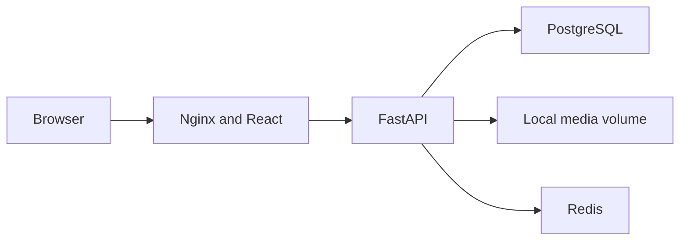

# Architecture

The public demo has four services: a React/Vite frontend served by Nginx, a FastAPI API, PostgreSQL with pgvector, and Redis. Nginx proxies `/api/` to FastAPI. The API reads relational object/annotation/transcript records and serves media from a named local volume. PostgreSQL and Redis have no host-published ports in the demo composition.

## Source responsibilities

- `apps/web/src/public`: public browse and Studio entry surfaces.
- `apps/web/src/evidence`: object, annotation, transcript, video, citation and sharing presentation.
- `apps/web/src/embed`: embedded object presentation.
- `apps/web/src/components/ModelCanvas.jsx`: rendering, annotation placement, camera and resource recovery.
- `apps/web/src/App.jsx`: authenticated console and legacy authoring workflows. Extract workflows incrementally while keeping route/API contracts stable.
- `apps/web/src/lib`: reusable policy, media, navigation, search and citation helpers.
- `apps/api/app/api`: HTTP routing and request/response contracts.
- `apps/api/app/models` and `alembic`: relational records and schema migrations.
- `apps/api/app/services`: publication projection, media, identity and optional processing services.
- `apps/api/app/scripts`: explicit local seed/content tools.

## Boundaries

Authenticated authoring stores private records. Public endpoints serialize an allowlisted projection. A newly created annotation remains private until explicitly reviewed and published. Public privacy checks exercise the actual database-backed projection. Runtime serving and local content preparation are separate responsibilities.

Remote promotion is optional and disabled in the demo. Its legacy process-local status implementation is unsuitable as a durable multi-process publication ledger. A future remote-publishing release should use an RQ worker plus database operation state, stage-specific idempotency and recovery.

External monitoring, transcription and embedding services are optional. The demo configures no paid API key, no monitoring DSN and no eager embedding download. Installing dependencies still contacts package registries. Large model/video files should be evaluated against device memory, decode capacity and network constraints.

The Compose quickstart is a loopback development demonstration. An internet deployment requires its own authentication, TLS, origin policies, secret management, database backups, capacity assessment and operating plan.
